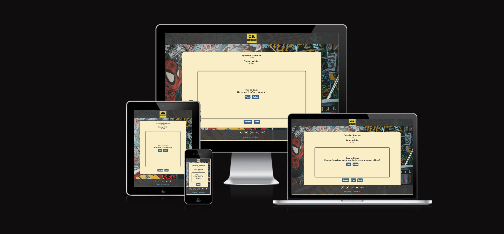
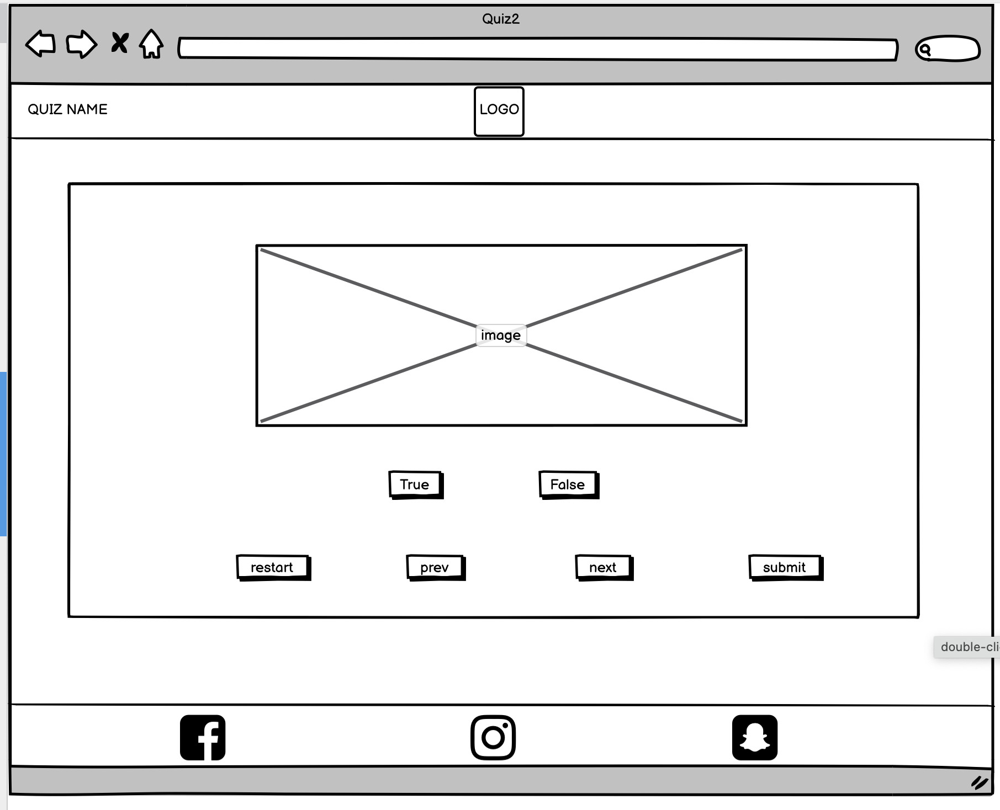
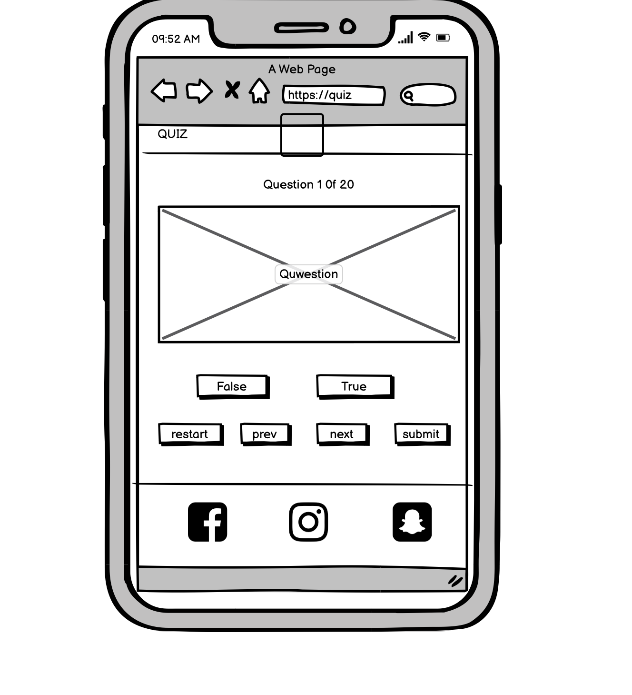

# pp2-Quiz



# Quizzers Assemble
This site is a  fun and interactive quiz for fans of the marvel franchise. It has a range of 15 true or false questions based on the Marvel movies. The questions cover topics such as characters, eventspp2-quiz-header facts about the movies. This site aims to be fun as well as educational.

The site's game keeps the track of the user's points and at the end of the quiz displays a message depending on the user's points.

## Features
---
### **Navigation Bar**

The Navigation Bar is found at the top of the page, the site is fully responsive on all screen sizes.
The Navigation Bar includes a logo that links to the Home Page.
### **Quiz Section**

The main quiz section of the website has the current question the user is on and below this, the user will find their points. The quiz section also includes the question and two buttons that have the value true or false.

### **Controls Section**

the controls section contains all the buttons the user needs to navigate through the game. The control buttons are restart, previous, next, and finish buttons. The restart button will reset the quiz back to question one and set the user's points back to zero. The next and previous button allows the user to navigate through the quiz. 
### **Footer**

The footer section includes links to the relevant social media sites for the Quizzers Assemble website. The links will open to a new tab to allow easy navigation for the user.
The footer is valuable to the user as it encourages them to keep connected via social media. Below the social media links is a short text noting the designer of the site.

### **Features Left to Implement**
In the future we hope to add:
* When a user answers and question and comes back to the question their answer is still selected.
* Images to the questions.
* Random question selected. So the quiz is different each time.
* Indicate to the user if the answer is correct or incorrect.
* A reveal below question explaining to the user why the answer is correct.

## User Experience (UX)
---
* ### **User stories**

    * **First-Time Visitor Goals**
        1. As a First Time Visitor, I want to be able to understand the main purpose of this site. I should be able to determine the aim of the site effortlessly and in a short period.

        2. As a First Time Visitor, I would like to be able to cycle through all the questions before answering

        3. As a First Time Visitor, I want my attention to be directly drawn to the questions.

    * **Returning Visitor Goals**
        1. As a Returning Visitor, I want to be able to share this website with family and friends via social media platforms.

        2.  As a Returning Visitor, I think my answer should be stored so that when I return to the question I can see what I chose.

        3.  As a Returning Visitor, I want to learn more about the organization behind the webpage.
    * **Frequent User Goals**
        1. As a Frequent User, I would like to see a pop-up message explaining a question if I got it wrong.

        2. As a Frequent User, I would like to create an account.

* ### **Design**
    * **Colour Scheme**
        *  As the site is based on comics and the marvel franchise. The current question and the user points are done in blue and red of the marvel logo and one of its main characters Captain America. The website background image is a collection of comic books with different yellows, reds, blues, and greys for contrast.
        * The quiz section is done in a neutral beige colour so it is easy on the user's eyes and will reduce fatigue. 
        * The controls are a marvel blue to link into the theme of the website.
    * **Typography**
        * The "Noto Serif Georgian" font is the main font used throughout the whole website with Georgia, Times, and serif as the fallback font respectively in case the font isn't being imported into the site correctly. "Noto Serif Georgian" is a clean, attractive, and appropriate font.
    * **Imagery**
         * The website background image is a collection of comic books with different yellows, reds, blues, and greys for contrast.
* ### **Wireframes**
**Webpage View**
   

   
**Mobile View**
   


   
## Technologies Used
---
### Languages Used
* [HTML5](https://en.wikipedia.org/wiki/HTML5)
* [CSS3](https://en.wikipedia.org/wiki/CSS)
* [Javascript](https://en.wikipedia.org/wiki/JavaScript)

 ### Programs Used

1. [Google Fonts](https://fonts.google.com/):
    * Google fonts were used to choose the fonts for this site. The fonts were declared in the style.css file which is used on all pages throughout the site.

1. [Font Awesome](https://fontawesome.com/):
    * Font Awesome was used on all pages throughout the website to add icons for social media links.

1. [Gitpod](https://www.gitpod.io/):
    * Gitpod terminal to commit to Git and Push to GitHub.

1. [GitHub](https://github.com/):
    * GitHub was used to store the site's code after being pushed from Gitpod.

1. [Visual Studio](https://visualstudio.microsoft.com/):
    * Visual Studio was used to create and write the code for the website.

1. [Balsamiq](https://balsamiq.com/):
    * Balsamiq was used to create the wireframes during the design process.


## Testing
---

## Validator Testing
* **HTML**
No errors were returned when passing through the official [W3C validator](https://kev-n14.github.io/pp2-Quiz/)
* **CSS**
No errors were found when passing through the official [(Jigsaw) validator](https://validator.w3.org/nu/#textarea)

###  **User Stories from the User Experience (UX) Section**
#### **First Time Visitor Goals**
1. As a First Time Visitor, I want to be able to understand the main purpose of this site. I should be to determine the aim of the site effortlessly and in a short period.

    * Upon visiting the site, users are greeted with a clean, spacious, and easy website.
    * The welcome message that greets the user, invites the user to the website and begins the quiz.
2. As a First Time Visitor, I would like to be able to cycle through all the questions before answering.
    * The user can go at their own pace and read through all the questions before answering any of the questions.
    * This combined with the neutral colour of the website makes for a relaxing and enjoyable experience.

3. As a First Time Visitor, I want my attention to be directly drawn to the questions.
    * In the center of the screen and in bold, is the welcoming message along with how to start the quiz.
    * This is what catches the eye of the user first. 
#### **Returning Visitor Goals**
1. As a Returning Visitor, I want to be able to share this website with family and friends via social media platforms.
    * At bottom of the website, users will find all social media links so they can share the website with their family and friends.

2.  As a Returning Visitor, I think my answer should be stored so that when I return to the question I can see what I had chosen.
    * In the future development of the website, a such function of storing the user's answer history will be implemented.

3.  As a Returning Visitor, I want to learn more about the organization behind the webpage.
    * The footer contains links to the organization's Facebook, Twitter, Instagram, YouTube, and LinkedIn pages.
    * Whichever link they click, will open up in a new tab to ensure the user can easily get back to the website.

#### **Frequent User Goals**
1. 1. As a Frequent User, I would like to see a pop-up message explaining a question if I got it wrong
    * In future versions of the website we are aiming to add an explanation of the incorrect answer with a pop window.
    * This will educate the user, while still having fun.

2. As a Frequent User, I would like to create an account.
    * As the website develops, we plan on adding a set up account section. So users can join with family and friends and share their results.

#### **Further Testing**
* The Website was tested on Google Chrome, Internet Explorer, Microsoft Edge, and Safari browsers.
* The website was viewed on a variety of devices such as desktops, laptops, iPhone7, iPhone 8 & Samsung Note 10.
* A large amount of testing was done on the website to ensure that all questions and results were responded to as they should.
* Friends and family members were asked to review the site and documentation to point out any bugs and/or user experience issues.
#### **Known Bugs**
* On some devices the main content page can seem empty.
* On smaller screen sizes the buttons stack on top of one another and overflow the main content area.


## Performance
---
### **Lighthouse content**
* Home Page

## Deployment
---
### **GitHub Pages**
This site was deployed to GitHub pages. The steps to deploy are as follows:
1. In the GitHub recurrentQitory, navigate to the Settings tab. 
1. On the left-hand side of the page is a list of choices. 
1. Find "Code and automation". The last item of this section is called "Pages".
1. Find "Build and deployment" From the source section drop-down menu, and select "Deploy from Branch". 
1. Below this is a Branch section, drop-down menu Select branch - select "Master" or "main".
1. The page will automatically be refreshed with a ribbon display across the top of the page to indicate the successful deployment.
1. The live link can be found here - 


### **Forking the GitHub RecurrentQitory**
By forking the GitHub RecurrentQitory we make a copy of the original recurrentQitory on our GitHub account to view and/or make changes without affecting the original recurrentQitory by using the following steps...

1. Log in to GitHub and locate the GitHub RecurrentQitory
1. At the top of the RecurrentQitory (not the top of the page) just above the "Settings" Button on the menu, locate the "Fork" Button.

1. You should now have a copy of the original recurrentQitory in your GitHub account.
### **Making a Local Clone**
1. Log in to GitHub and locate the GitHub RecurrentQitory
1. Under the recurrentQitory name, click "Clone or download".

1. To clone the recurrentQitory using HTTPS, under "Clone with HTTPS", copy the link.
1. Open Git Bash
1. Change the current working directory to the location where you want the cloned directory to be made.
1. Type git clone, and then paste the URL you copied in Step 3.
```
$ git clone https://github.com/YOUR-USERNAME/YOUR-REcurrentQITORY
```
Press Enter. Your local clone will be created.
```
$ git clone https://github.com/YOUR-USERNAME/YOUR-REcurrentQITORY
> Cloning into `CI-Clone`...
> remote: Counting objects: 10, done.
> remote: Compressing objects: 100% (8/8), done.
> remove: Total 10 (delta 1), reused 10 (delta 1)
> Unpacking objects: 100% (10/10), done.
```

## Credits
---
* ### **Content**
   * The icons in the footer for social media links were taken from Font Awesome 

* ### **Media**
* The favicon was from [favicon](https://www.flaticon.com/free-icons/marvel).
* The icon in the navigation bar was created by the developer using Adobe Express.
* The photos used on the Home and sign-up pages of the site were taken from [unsplash](https://unsplash.com/).
